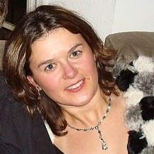
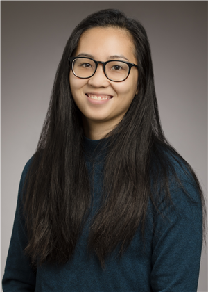
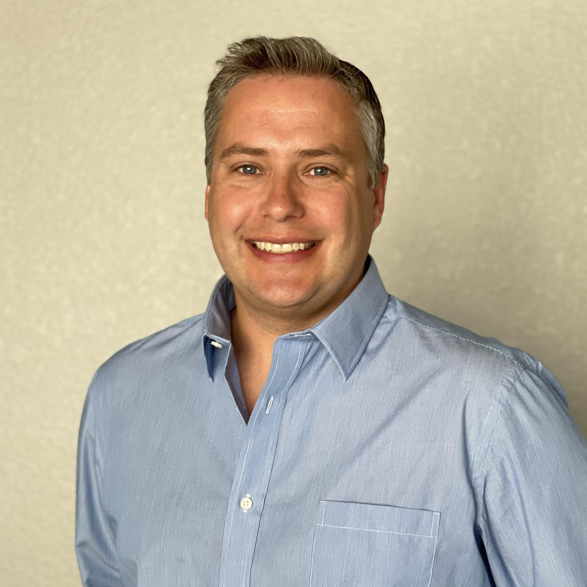
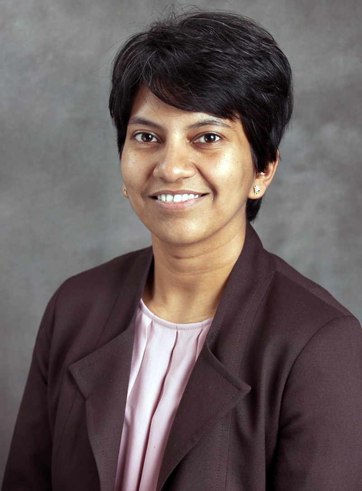
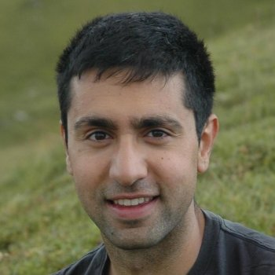
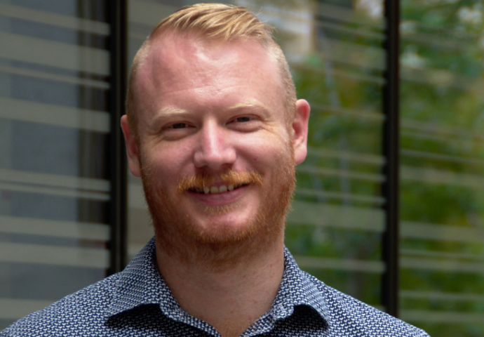

# Design and Simulation of Superconducting Qubits

@ IEEE Quantum Week 2022

Registration available at <https://qce.quantum.ieee.org/registration/>.

10:00-16:45 Mountain Time (MDT), Thursday, Sept 22, 2022

## Abstract

Superconducting qubits are a leading modality in quantum computing. Innovation in superconducting device architecture is rapidly expanding, leading to an explosion of new designs. However, being a novel field, there is a lack of standardization in design flow processes, which limits the speed of design iteration. Industry professionals and academic researchers alike can easily spend many months on the iterative process of designing and testing their circuits. This process involves laying down a prospective architecture, simulating at both the circuit and quantum Hamiltonian level, and ends with the lengthy process of device fabrication and testing. To accelerate this process, a tighter coupling between design and Hamiltonian simulation methods is needed. More efficient and rigorous testing of prospective designs in simulation has the potential to vastly improve the “virtual prototyping’’ process, in which designs are more thoroughly tested in simulation before moving to the fabrication phase, allowing for faster iteration of designs.

The goal of this workshop is to bring together experts in both superconducting qubit design and quantum system simulation to share their expertise. In the first session, leaders in both fields are invited to present the state of the art. The second session will follow this up with more pedagogically focused presentations on the foundational topics in superconducting qubit design, and quantum system simulation and optimization, providing a theoretical foundation for those new to either field. Finally, the third session will consist of a practical demonstration of these principles, using the open source software tools Qiskit Metal and Qiskit Dynamics to walk through an example of the design and optimization process from start to finish. More integrated tools for system design and simulation processes have the potential to streamline the iterative prototyping process, leading to more rapid innovation.

## Agenda

<a href='https://qce.quantum.ieee.org/2022/home/program/program-schedule/'>Full IEEE Quantum Week Agenda<a/>

- 10:00 - 11:30 First Speaker Session
- 11:30 - 1:00 Lunch (General IEEE Quantum event)
- 1:00 - 2:30 Second Speaker session
- 2:30 - 3:15 Break and Posters (General IEEE Quantum event)
- 3:15 - 4:45 Tool demonstration

### 10:45 - 12:15 Speaker Session 1

| Time  &nbsp; | Speaker  &nbsp;&nbsp;&nbsp;&nbsp;&nbsp;&nbsp;&nbsp;&nbsp;&nbsp;&nbsp;&nbsp;&nbsp;&nbsp;&nbsp;&nbsp;&nbsp;&nbsp;&nbsp;&nbsp;&nbsp;&nbsp;&nbsp;&nbsp;&nbsp;&nbsp;&nbsp;&nbsp;&nbsp;&nbsp;&nbsp;&nbsp;&nbsp;&nbsp;&nbsp;&nbsp;&nbsp;&nbsp;&nbsp;&nbsp;&nbsp;&nbsp;&nbsp;&nbsp;&nbsp;&nbsp;&nbsp;&nbsp;&nbsp;&nbsp;&nbsp;&nbsp;&nbsp;&nbsp;&nbsp;&nbsp;&nbsp;&nbsp; | Topic  &nbsp; |
|------|---------|-------|
|10:00 | <b><a href='https://www.linkedin.com/in/benjamin-rosand/'>Benjamin Rosand<a/><b/>   Quantum Software *@* IBM Quantum | Introduction |
|10:03 | <b><a href='https://physics.northwestern.edu/people/faculty/core-faculty/jens-koch.html'>Jens Koch<a/><b/>   Associate Professor *@* Northwestern University   Co-Director, Applied Physics Graduate Program Department of Physics and Astronomy  | "Computer-aided quantization and numerical analysis of custom circuits with scqubits" |
|      |  |The development of new superconducting circuits and the improvement of existing ones rely on the accurate modeling of spectral properties key to achieving needed advances in qubit performance. Systematic circuit analysis at the lumped-element level, starting from a circuit network and culminating in a Hamiltonian appropriately describing the quantum properties of the circuit, is a well-established procedure, yet cumbersome to carry out manually for larger circuits. We discuss the circuit module extension to the open-source scqubits package which now utilizes symbolic computer algebra and numerical diagonalization routines versatile enough to tackle a variety of circuits. |
|10:23 | <b><a href='https://www.nist.gov/people/katarina-cicak'>Katarina Cicak<a/><b/>   Researcher *@* National Institute of Standards and Technology  | "Evolving devices for superconducting qubit technology" |
|      | |Our early work to understand sources of decoherence in superconducting (SC) qubits two decades ago improved basic SC microwave circuit components and circuit connectivity, informed modern transmon qubit design, and ultimately advanced SC technology for quantum information. The push to integrate and hybridize devices in order to access, connect, and exploit the quantum across different physical realms led to high performance devices like vacuum-gap capacitor drums in optomechanics, electro-optical quantum transducers for connecting disparate quantum systems from the microwave to the optical, and quantum efficient Josephson amplifiers on a versatile fabrication platform. Here we reveal key features that enable the innovation in these devices.  The overview of the technology presented serves as a good introduction to concepts informing design and simulation of SC devices in context of processes detrimental to quantum information, like loss, noise, and decoherence. |
|10:43 | <b><a href='https://physics.illinois.edu/people/directory/profile/akou'>Angela Kou<a/><b/>   Associate Professor *@* University of ILlinois Urbana-Champaign  | "Building a hybrid quantum device from an Andreev spin qubit and a superconducting transmon" |
|      | |Hybrid superconducting circuits, which integrate non-superconducting elements into a circuit quantum electrodynamics (cQED) architecture expand the possible applications of cQED. For example, superconducting devices coupled to semiconducting spin qubits would enable long-distance coupling between long-lifetime spin qubits. Proper design of hybrid devices, however, require simulations of both the superconducting device and the non-superconducting elements. In this talk, I will discuss our experimental work coupling an Andreev spin qubit (ASQ) to a superconducting transmon and the associated theoretical work necessary to design our devices. We first use the transmon to perform spectroscopy on the ground states of a quantum dot with superconducting leads and map out the phase diagram of the superconductor-quantum dot-superconductor device. We then use the spin-split doublet ground state of S-QD-S device to form our ASQ and demonstrate direct coherent manipulation of the ASQ with Rabi rates of up to 200 MHz. Finally, we strongly coherently couple the ASQ to the transmon, which paves the way toward using superconducting devices to mediate interactions between distant ASQs. |
|11:03  |Moderator <b><a href='https://www.nist.gov/people/john-teufel'>John Teufel<a/><b/>   Quantum Physicist *@*  National Institute of Standards and Technology | **Panel Discussion** |
|      | | |
{: .tablelines}

### 1:00 - 2:30 Speaker Session 2

| Time  &nbsp; | Speaker  &nbsp;&nbsp;&nbsp;&nbsp;&nbsp;&nbsp;&nbsp;&nbsp;&nbsp;&nbsp;&nbsp;&nbsp;&nbsp;&nbsp;&nbsp;&nbsp;&nbsp;&nbsp;&nbsp;&nbsp;&nbsp;&nbsp;&nbsp;&nbsp;&nbsp;&nbsp;&nbsp;&nbsp;&nbsp;&nbsp;&nbsp;&nbsp;&nbsp;&nbsp;&nbsp;&nbsp;&nbsp;&nbsp;&nbsp;&nbsp;&nbsp;&nbsp;&nbsp;&nbsp;&nbsp;&nbsp;&nbsp;&nbsp;&nbsp;&nbsp;&nbsp;&nbsp;&nbsp;&nbsp;&nbsp;&nbsp;&nbsp; | Topic  &nbsp; |
|------|---------|-------|
|1:00 | <b><a href='https://www.uml.edu/sciences/physics/faculty/kamal-archana.aspx'>Archana Kamal<a/><b/>   Associate Professor *@* UMass Lowell   | "PIQUE: a new framework for quantum systems engineering" |
|      |  |High-fidelity quantum state preparation, manipulation and measurement are the three cornerstones of any quantum information processing platform. In this talk I will describe a new paradigm called PIQUE (for Parametrically-Induced QUantum Engineering), which promises new functionalities to tackle all three challenges in a unified framework employing parametric interactions between quantum systems. In the first part of my talk, I will focus on how parametrically-induced interactions can be leveraged for quantum reservoir engineering, specifically high-fidelity dissipative control and scalable entanglement generation. In the second part, I will focus on some recent results on the emerging platform of “parametric circuit-QED“ that provides new mechanisms for readout and control of quantum systems. |
|1:20 | <b><a href='https://profiles.stanford.edu/amir-safavi-naeini'>Amir Safavi-Naeini<a/><b/>   Associate Professor *@* Stanford University  | "TBD" |s
|      | |TBD. |
|1:40 | <b><a href='https://scholar.google.com/citations?user=Q0j-7W0AAAAJ&hl=en'>Holger Haas<a/><b/>   Research Staff Member *@* IBM Quantum  | "Quantum control strategies for enhancing fixed frequency transmon performance" |
|      | |Fixed frequency transmon qubit architectures come with always-on inter-qubit ZZ coupling, or quantum crosstalk, that can induce decoherence and gate errors. It is known that quantum control strategies, specifically, the application of phase and amplitude adjusted Stark shift tones on individual qubits (siZZle protocol), can negate the effect of such quantum crosstalk. We demonstrate the implementation of siZZle protocol for a 27-qubit device and present its implications for probabilistic error correction. Furthermore, we also discuss the simulation and use of amplitude-shaped Stark shift tones for implementing CZ gates. |
|2:00  |Moderator <b><a href='https://scholar.google.com.au/citations?user=CxoASb4AAAAJ&hl=en'>Michael Hush<a/><b/>   Chief Science Officer *@*  Q-Ctrl | **Panel Discussion** |
|      | | |
{: .tablelines}
<!-- 
<table>
  <tr>
    <th>Time</th>
    <th>Speaker(s)</th>
    <th>Topic <th>
  </tr>
  <tr>
    <td>1:00
    <td><a href='https://www.uml.edu/sciences/physics/faculty/kamal-archana.aspx'><b>Archana Kamal</b></a></td>
    <td>"Using Qiskit Metal to assist quantum device designing on 2D and 3D architectures"</td>
  </tr>
  <tr>
    <td></td>
    <td colspan="2"></td>
    <td>The optimization of the design of the superconducting circuits, including their structure, geometry, size, choice of material, etc., is key toward noise-resilient quantum computation. An efficient simulation tool that predicts the qubit parameters and performance under these specifications will not only save significant amount of experimental resource, but also enable more efficient exploration on novel experimental designs. In this talk, I first summarize the efforts on designing superconducting resonators at SQMS using Qiskit Metal and present the measurements on these devices. We explicitly show how Metal makes the designing more convenient. Second, I show some newly proposed designs, and present the simulation results by Metal. Finally, future efforts at SQMS on not only 2D but also 3D designs using this toolkit will be discussed.</td>
  </tr>

</table>
BREAK_______
<table>
  <tr>
    <th>Time</th>
    <th>Speaker(s)</th>
    <th>Topic <th>
  </tr>
  <tr>
    <td>1:00
    <td><a href='https://scholar.google.com/citations?user=YW1hekQAAAAJ&hl=en'><b>Ziwen Huang</b></a></td>
    <td>"Using Qiskit Metal to assist quantum device designing on 2D and 3D architectures"</td>
  </tr>
  <tr>
    <td></td>
    <td colspan="2"></td>
    <td>The optimization of the design of the superconducting circuits, including their structure, geometry, size, choice of material, etc., is key toward noise-resilient quantum computation. An efficient simulation tool that predicts the qubit parameters and performance under these specifications will not only save significant amount of experimental resource, but also enable more efficient exploration on novel experimental designs. In this talk, I first summarize the efforts on designing superconducting resonators at SQMS using Qiskit Metal and present the measurements on these devices. We explicitly show how Metal makes the designing more convenient. Second, I show some newly proposed designs, and present the simulation results by Metal. Finally, future efforts at SQMS on not only 2D but also 3D designs using this toolkit will be discussed.</td>
  </tr>
 </table> -->

### 3:15 - 4:45 Tool demonstration

<table>
  <tr>
    <th>Time</th>
    <th colspan="2">Speaker(s)</th>
    <th>Topic <th>
  </tr>

  <tr>
    <td>3:15
    <td>Yehan Liu</td>
    <td>Patrick O'Brien</td>
    <td>TBD Topic</td>
  </tr>
  <tr>
  </tr>
  <tr>
    <td></td>
    <td></td>
    <td></td>
    <td>TBD abstract</td>
  </tr>

  <tr>
    <td>3:50
    <td><a href='https://scholar.google.com/citations?user=YW1hekQAAAAJ&hl=en'><b>Ziwen Huang</b></a></td>
    <td>"Using Qiskit Metal to assist quantum device designing on 2D and 3D architectures"</td>
  </tr>
  <tr>
    <td></td>
    <td colspan="2"></td>
    <td>The optimization of the design of the superconducting circuits, including their structure, geometry, size, choice of material, etc., is key toward noise-resilient quantum computation. An efficient simulation tool that predicts the qubit parameters and performance under these specifications will not only save significant amount of experimental resource, but also enable more efficient exploration on novel experimental designs. In this talk, I first summarize the efforts on designing superconducting resonators at SQMS using Qiskit Metal and present the measurements on these devices. We explicitly show how Metal makes the designing more convenient. Second, I show some newly proposed designs, and present the simulation results by Metal. Finally, future efforts at SQMS on not only 2D but also 3D designs using this toolkit will be discussed.</td>
  </tr>

  <tr>
    <td>4:10
    <td>Daniel Puzzuoli</td>
    <td>Benjamin Rosand</td>
    <td>TBD Topic</td>
  </tr>

  <tr>
    <td></td>
    <td></td>
    <td></td>
    <td>TBD abstract</td>
</table>

### Organizers

Benjamin Rosand: IBM Quantum, USA

Patrick O'Brien: IBM Quantum, USA

Yehan Liu: IBM Quantum, USA

Daniel Puzzuoli: IBM Quantum, Canada
